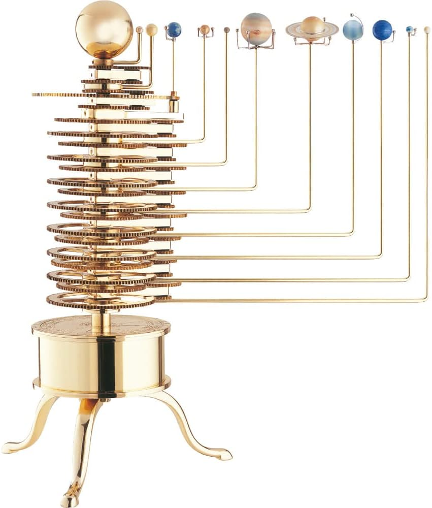

# Solar Sim

This repo is to simulate a solar system. I have always been interested in physics, taking it for A Levels and later in life taking up astronomy and purchasing my own telescope. I also, always thought that mechanical solar system model were extremely cool (please see below). In this project I am to be able to simulate planets and how they would orbit within a solar system.

## Mechanical Solar System Model

## Outcomes

It would be first good to get a set of goals out of what I want to achieve for this project:

- Build a working model of our solar system in Python.
  - Capture information about each body in the solar system, this should include The Sun, all the planets. I may also throw in a comment or two.
  
  - Add equations to the simulate gravitational pull on each but then also the rotation and orbit of each of the planets.

  - Ability to change time. This can be hard coded but being able to speed up the simulation would be good.

  - Having the option to turn off and on collisions.

- Visualise the system.

  - Being able to view the simulation as it evolves.

  - On the visualisation show the planets moving, with their relative proportions being intact.

  - Tracing of the planets, showing path they moved in the last x number of time units.

## Build

### Celestial Objects

Celestial Objects are naturally occuring physical entities. According to Wikipedia there is a  difference between celestial *bodies* and *objects*.
Bodies are typically tightly bound in terms of its structure, whereas, objects are perhaps not so. i.e. a Galaxy, star cluster, or solar system would be an Object as it not one physically bound object, but a planet would be a body, as it is a single, tightly bound entity.

Some are much larger than others. The main focus of this project is to simulate our solar system. To break the project down it 